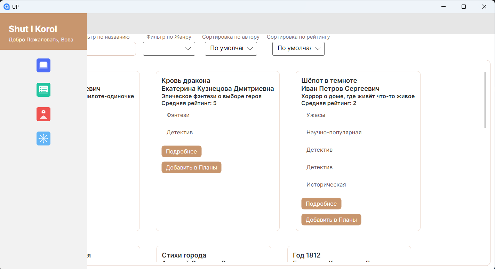
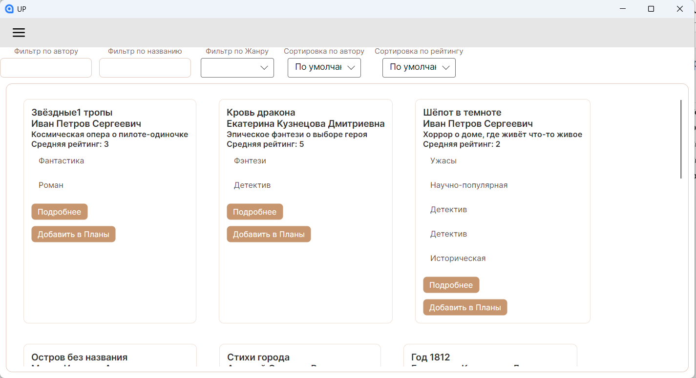
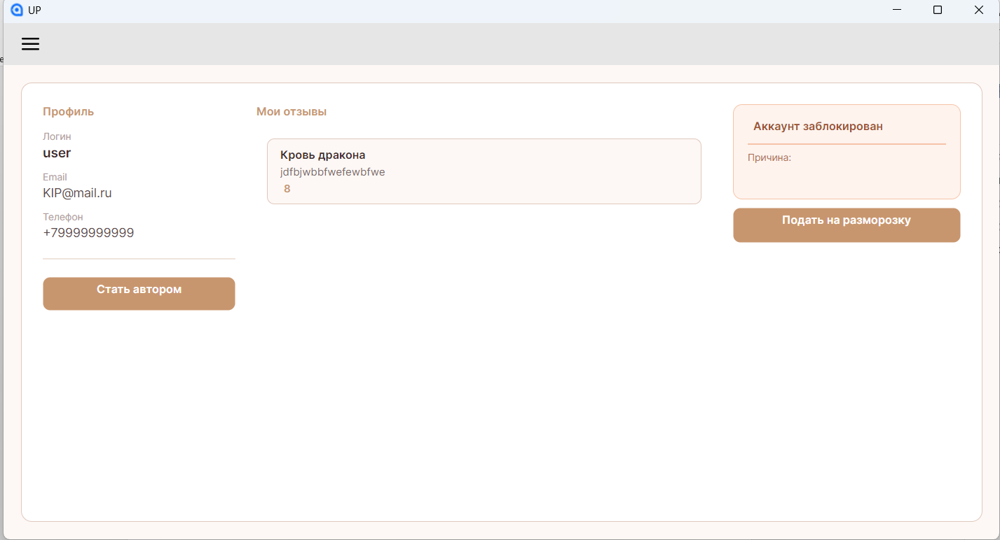

<div align="center">

```
███████╗██╗  ██╗██╗   ██╗████████╗██╗██╗  ██╗ ██████╗ ██████╗  ██████╗ ██╗
██╔════╝██║  ██║██║   ██║╚══██╔══╝██║██║ ██╔╝██╔═══██╗██╔══██╗██╔═══██╗██║
███████╗███████║██║   ██║   ██║   ██║█████╔╝ ██║   ██║██████╔╝██║   ██║██║
╚════██║██╔══██║██║   ██║   ██║   ██║██╔═██╗ ██║   ██║██╔══██╗██║   ██║██║
███████║██║  ██║╚██████╔╝   ██║   ██║██║  ██╗╚██████╔╝██║  ██║╚██████╔╝███████╗
╚══════╝╚═╝  ╚═╝ ╚═════╝    ╚═╝   ╚═╝╚═╝  ╚═╝ ╚═════╝ ╚═╝  ╚═╝ ╚═════╝ ╚══════╝
```

**Десктопное приложение для онлайн-библиотеки**


</div>

---

## 📖 О проекте

**ShutIkorol** — кросс-платформенное десктопное приложение для онлайн-библиотеки, разработанное в рамках учебной практики по специальности **09.02.07 «Информационные системы и программирование»**.

Приложение позволяет читателям просматривать каталог книг, вести списки чтения и оставлять рецензии, авторам — публиковать книги и управлять ими, а администраторам — модерировать контент и управлять пользователями.

---

## 🛠️ Технологический стек

| Слой | Технология |
|------|-----------|
| **Платформа** | .NET 8 |
| **UI-фреймворк** | Avalonia UI |
| **Паттерн** | MVVM + CommunityToolkit.Mvvm |
| **ORM** | Entity Framework Core |
| **База данных** | Microsoft SQL Server |
| **DI-контейнер** | Microsoft.Extensions.DependencyInjection |
| **Архитектурные паттерны** | Factory Pattern, Singleton (AppState) |
| **Диалоговые окна** | WpfLikeAvaloniaMessageBox |

---

## 🏗️ Архитектура

Проект построен на паттерне **MVVM** и разделён на чёткие слои:

```
UP/
├── Assets/                     # Иконки навигации и ресурсы
│   ├── 01_catalog.png
│   ├── 02_lists.png
│   ├── 03_admin.png
│   ├── 04_author.png
│   ├── 05_frozen.png
│   └── 06_profile.png
│
├── Context/
│   └── MyDbContext.cs          # EF Core DbContext
│
├── Models/                     # Сущности базы данных
│   ├── Book.cs
│   ├── User.cs
│   ├── UserFio.cs
│   ├── UserPartial.cs
│   ├── Review.cs
│   ├── Genre.cs
│   ├── BookGenre.cs            # Many-to-many связь
│   ├── Role.cs
│   ├── RoleBid.cs
│   ├── ReadingList.cs
│   ├── Rltype.cs
│   ├── Report.cs
│   ├── FrozenBid.cs
│   └── BidTypes.cs
│
├── Services/                   # Инфраструктурные сервисы
│   ├── AppState.cs             # Глобальное состояние (singleton)
│   ├── NavigationService.cs    # Навигация между страницами
│   ├── MessageBoxService.cs    # Диалоговые окна
│   └── PageFactory.cs          # Фабрика страниц (Factory Pattern)
│
├── ViewModels/                 # Логика представления (MVVM)
│   ├── ViewModelBase.cs
│   ├── MainWindowViewModel.cs
│   ├── AuthPageViewModel.cs
│   ├── RegistrationPageViewModel.cs
│   ├── FirstPageViewModel.cs
│   ├── CurrentBookPageViewModel.cs
│   ├── ListsPageViewModel.cs
│   ├── ProfilePageViewModel.cs
│   ├── BidPageViewModel.cs
│   ├── FreezePageViewModel.cs
│   ├── AuthorPageViewModel.cs
│   ├── AddBookPageViewModel.cs
│   ├── EditBookAuthorPageViewModel.cs
│   ├── AdminPageViewModel.cs
│   ├── AdminReportPageViewModel.cs
│   ├── AdminUsersListPageViewModel.cs
│   ├── AdminAuthorBidPageViewModel.cs
│   ├── AdminFrozenBidPageViewModel.cs
│   └── AdminFrozenListPageViewModel.cs
│
├── Views/                      # XAML-интерфейсы
│   ├── AdminViews/
│   │   ├── AdminAuthorBidPage.axaml
│   │   ├── AdminFrozenBidPage.axaml
│   │   ├── AdminFrozenListPage.axaml
│   │   ├── AdminReportPage.axaml
│   │   └── AdminUsersListPage.axaml
│   ├── MainWindow.axaml
│   ├── AuthPage.axaml
│   ├── RegistrationPage.axaml
│   ├── FirstPage.axaml
│   ├── CurrentBookPage.axaml
│   ├── ListsPage.axaml
│   ├── ProfilePage.axaml
│   ├── BidPage.axaml
│   ├── FreezePage.axaml
│   ├── AuthorPage.axaml
│   ├── AddBookPage.axaml
│   ├── EditBookAuthorPage.axaml
│   └── AdminPage.axaml
│
├── App.axaml                   # Точка входа UI
├── Core.cs                     # Конфигурация DI-контейнера
└── Program.cs                  # Точка входа приложения
```

---

## 👥 Роли пользователей

```
┌─────────────┐     ┌─────────────┐     ┌─────────────┐
│   Читатель  │     │    Автор    │     │ Администра- │
│             │     │             │     │     тор     │
├─────────────┤     ├─────────────┤     ├─────────────┤
│ • Каталог   │     │ • Каталог   │     │ • Все экра- │
│   книг      │     │   книг      │     │   ны читате-│
│ • Списки    │     │ • Добавление│     │   ля/автора │
│   чтения    │     │   книг      │     │ • Управление│
│ • Рецензии  │     │ • Редактиро-│     │   пользова- │
│ • Профиль   │     │   вание     │     │   телями    │
│ • Заявка на │     │ • Профиль   │     │ • Модерация │
│   автора    │     │ • Заморозка │     │   заявок    │
└─────────────┘     └─────────────┘     │ • Отчёты   │
                                        └─────────────┘
```

---

## ⚙️ Ключевые решения

### Dependency Injection
Все компоненты регистрируются в DI-контейнере при старте через `Core.Initialize()`. ViewModel-ы регистрируются как `Transient`, сервисы навигации и состояния — как `Singleton`.

### Factory Pattern (PageFactory)
Навигация между страницами реализована через `PageFactory`, которая создаёт нужный `UserControl` через DI-контейнер по строковому ключу. Это позволяет избежать прямых зависимостей между страницами.

### AppState (Singleton)
Синглтон `AppState` хранит данные текущего авторизованного пользователя и его роль, доступные из любого ViewModel-а через DI.

### CommunityToolkit.Mvvm
Использование атрибутов `[ObservableProperty]` и `[RelayCommand]` позволяет генерировать шаблонный код через Source Generators, сокращая объём кода и устраняя ручную реализацию `INotifyPropertyChanged`.

---

## 🚀 Запуск проекта

### Требования

- [.NET 8 SDK](https://dotnet.microsoft.com/download/dotnet/8.0)
- Microsoft SQL Server (local или remote)
- IDE: JetBrains Rider или Visual Studio 2022+

### Установка

```bash
# 1. Клонировать репозиторий
git clone https://github.com/username/ShutIkorol.git
cd ShutIkorol

# 2. Настроить строку подключения в Core.cs
# Server=.;Database=ShutIkorol;Trusted_Connection=True;TrustServerCertificate=True;

# 3. Применить миграции EF Core
dotnet ef database update

# 4. Запустить приложение
dotnet run
```

---

## 🗄️ База данных

Приложение работает с базой данных **ShutIkorol** на SQL Server. Схема включает следующие основные таблицы:

| Таблица | Описание |
|---------|----------|
| `Users` | Пользователи системы |
| `Roles` | Роли (читатель, автор, администратор) |
| `Books` | Книги |
| `Genres` | Жанры |
| `BookGenres` | Связь книга–жанр (many-to-many) |
| `Reviews` | Рецензии пользователей |
| `ReadingLists` | Списки чтения |
| `Reports` | Жалобы и отчёты |
| `FrozenBids` | Заявки на заморозку |
| `RoleBids` | Заявки на смену роли |

---

## 🖼️ Скриншоты

<table>
  <tr>
    <td align="center"><b>Главное окно с навигацией</b></td>
    <td align="center"><b>Каталог книг</b></td>
    <td align="center"><b>Профиль пользователя</b></td>
  </tr>
  <tr>
    <td></td>
    <td></td>
    <td></td>
  </tr>
</table>

---

## 📚 Учебная практика

Проект разработан в рамках:

- **Специальность:** 09.02.07 «Информационные системы и программирование»
- **Профессиональный модуль:** ПМ.01 Разработка модулей ПО для компьютерных систем
- **МДК:** 01.01 Разработка программных модулей
- **Учебное заведение:** Колледж информатики и программирования, Финансовый университет при Правительстве РФ
- **Группа:** 3ИСИП-323

---

<div align="center">

*Разработано в рамках учебной практики УП 01.01 · 2026*

</div>
